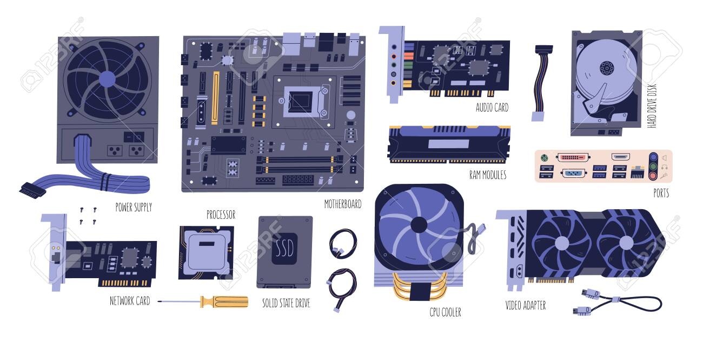

## For most computers there are a couple of critical physical components:

- Enclosure: A convienient case to hold all the components securely  in place
- Power Supply: Converts Alternating Current (AC) power from your wall to Direct Current (DC) power that the electronics can use.
- Motherboard: Holds all the circuits which allow subsystems to communicate
- Expansion Cards: Allows for specialized workloads like graphics, audio, and networking
- Storage Devices: Provides the ability to maintain data for short and long terms.
- Peripherals: Generally allow the user (that's you) to interact with the system. Things  like mice, keyboards, and headphones.

