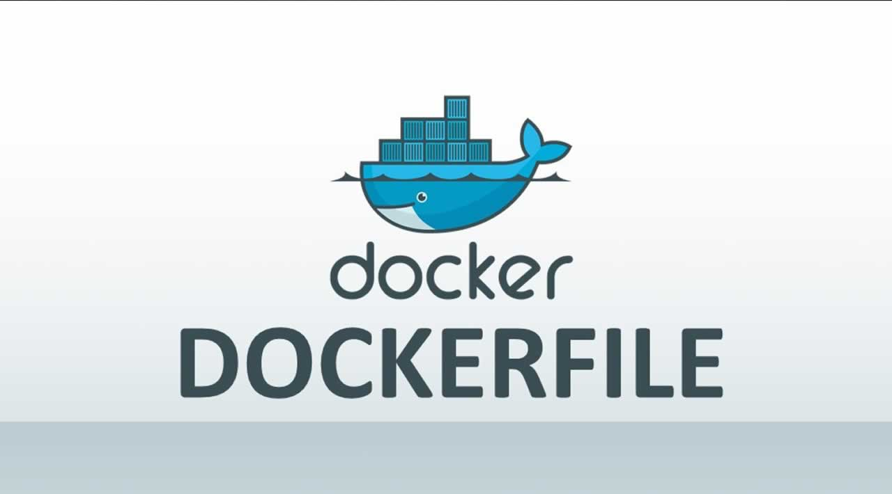

Other important instructions are available which can allow the Docker Container to (among other things):

- Communicate over specific network ports (EXPOSE)
- Connect to storage devices (VOLUME)
- Be defined by custom labels (LABEL)

To learn more about these instructions, [check out this page!](https://docs.docker.com/engine/reference/builder/) 

