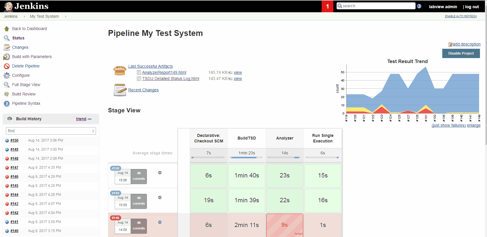

# So how do apply continuous integration practices to my development workflow?

Many CI Tools exist, one of the most popular and best supported is Jenkins.

Jenkins integrates with numerous source code repositories, plugins, test suites, and external services to
automate building and testing of software applications.

Build pipelines can be triggered either manually, or via push to a configured source code repository. These 
pipelines can be configured to run, collect, and display test results over time. The pipelines themselves 
can be managed and source controlled using `Jenkinsfiles`.
