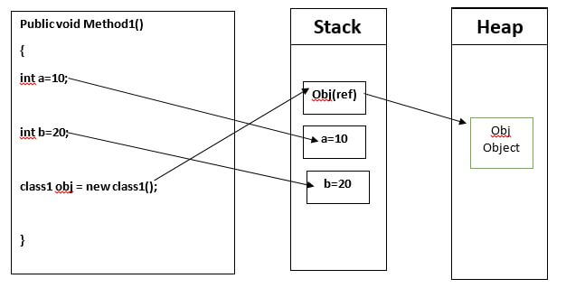

## The "Heap"

Just like the letter blocks we saw before, the blocks of the stack use up a _regular_ amount of space called a _word_.

But what if we want to store something _bigger_ than a word? That's where the heap comes in.

Let's imagine you want to remember where your friend lives:

Obviously you can take their house with you in your pocket. What you do instead, is write down the _address_.

Such is the same with computers, stacks, and heaps.

For large objects, the computer save the _memory location_ of the object on the stack, while the object itself lives in the heap!