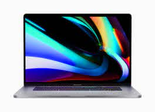
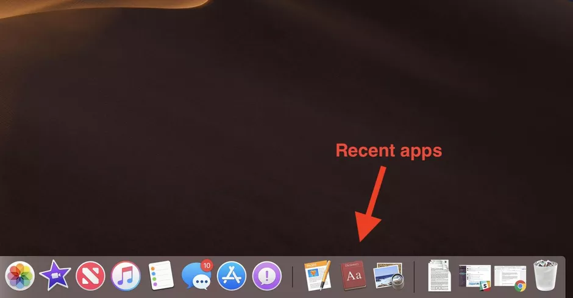

# Virtual Machine Images

A Virtual Machine Image is a clone on a computer contained in a single file. This includes all the software running 
(and not running) on the computer. Though it would be interesting, we can't put the hardware itself in a file; only the
software. Think of this as a recipe to bake your computer, exactly as it's running, right now.

Imagine everything on your current computer contained in a single file.

## Let's explore an example:

Let's say your friend just lent you their Macbook with the latest version of MacOS, _Big Sur_.

As you open it up, you see a couple of programs running: 

### Using the trackpad, you click on _Safari_ and using the keyboard, you type in _www.youtube.com_.

Which of the things you interacted with do you think would be part of the virtual machine image?