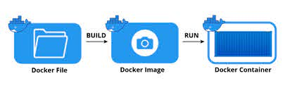

# Docker Images

Remember back to **Lesson 4: Virtual Machine Images**. Docker has a special
version of this for containerized applications, called _Docker Images_.

As shown above, _Docker Files_ are used to build _Docker Images_ which create
_Docker Containers_.

**click `Dockerfile`{{open}} to open**

To the right, you see a simple Dockerfile, we'll talk about the major components of
Docker Files in the next lesson. For now, run the following commands to build the 
Docker Image, and run the Docker Container.

### 1. Build the Docker Image
**`docker build -t katacoda_example_game:latest .`{{execute}}** 

### 2. Run the Docker Container
**`docker run -t katacoda_example_game:latest` {{execute}}**
